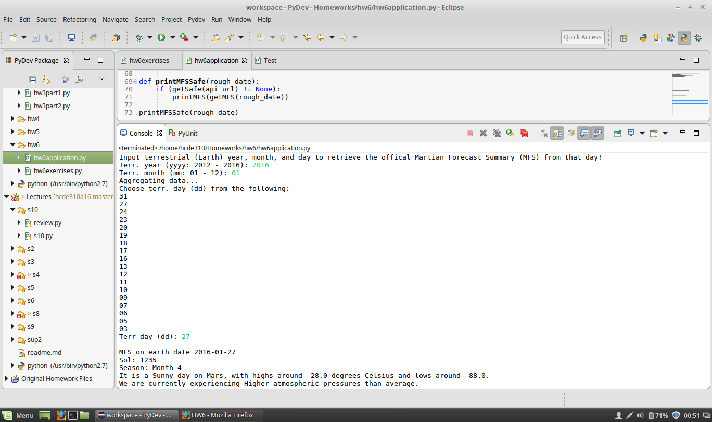

# hw6application.py
## "Martian Forecast Summary"

This program takes in user console input to produce a summary of the forecast
generated by the Mars Weather API. There are a couple of status messages where
the program has to "think" for a while. This program also tests that the request
url exists before attempting to extract information from it.

To test, I've plugged in the date of my birthday this year:

